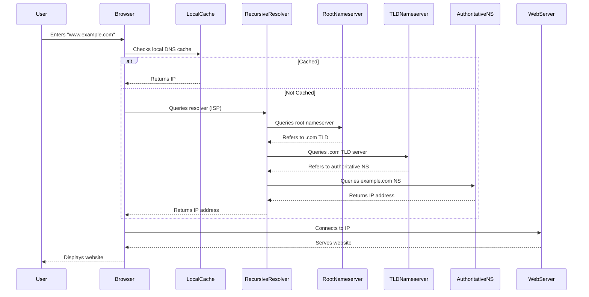
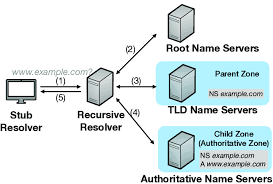
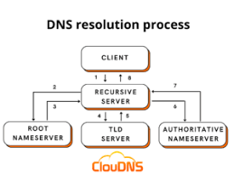

# DNS Tutorial: Understanding the Domain Name System

## What is DNS?

DNS (Domain Name System) is often called the "phonebook of the internet." It translates human-friendly domain names (like www.example.com) into machine-readable IP addresses (like 192.0.2.1).

## How DNS Works

### Basic DNS Resolution Process:

1. **User Request**: You type "www.example.com" in your browser
2. **Local Cache Check**: Your computer checks its local DNS cache
3. **Recursive Resolver**: If not cached, your request goes to a DNS recursive resolver (usually provided by your ISP)
4. **Root Nameserver**: The resolver queries a root nameserver
5. **TLD Nameserver**: The root directs to the Top-Level Domain (TLD) server (.com in this case)
6. **Authoritative Nameserver**: The TLD server directs to the domain's authoritative nameserver
7. **IP Address Returned**: The authoritative server provides the IP address
8. **Website Loaded**: Your browser connects to the IP address




This diagram shows:
1. The user initiating the request
2. The local cache check (with alternative paths for cached/not cached)
3. The hierarchical DNS resolution process (recursive resolver → root → TLD → authoritative)
4. The final connection to the web server
5. The website being displayed to the user


## DNS Components

### 1. DNS Records

Common DNS record types:

- **A Record**: Maps a domain to an IPv4 address
- **AAAA Record**: Maps a domain to an IPv6 address
- **CNAME Record**: Creates an alias from one domain to another
- **MX Record**: Specifies mail servers for the domain
- **TXT Record**: Contains text information (often used for verification)
- **NS Record**: Specifies authoritative nameservers for the domain
- **SOA Record**: Contains administrative information about the zone

### 2. DNS Servers

- **Recursive Resolvers**: Servers that receive DNS queries from client machines
- **Root Nameservers**: 13 logical servers that direct queries to TLD servers
- **TLD Nameservers**: Servers for top-level domains (.com, .org, .net, etc.)
- **Authoritative Nameservers**: Servers that hold the actual DNS records


## Common DNS Tools

1. **nslookup**: Command-line tool for querying DNS
   ```
   nslookup example.com
   ```

2. **dig**: More advanced DNS lookup tool (Linux/macOS)
   ```
   dig example.com
   ```

3. **whois**: Provides domain registration information
   ```
   whois example.com
   ```



