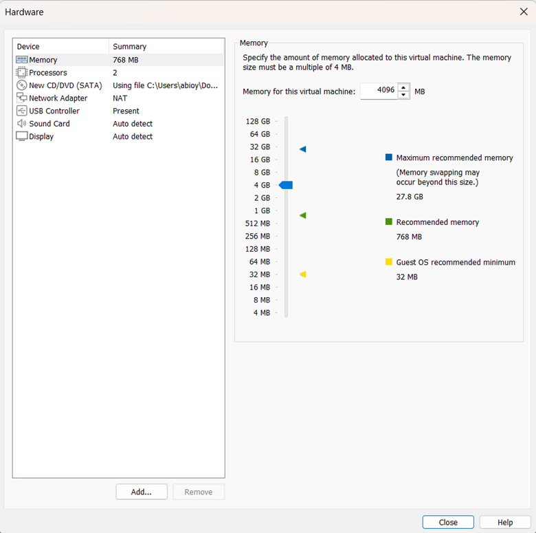

# Setting Up Kali Linux on VMware

## Step 1: Downloading Kali Linux ISO

To install Kali Linux, we first need the installation file (ISO).

1. Visit the [official Kali Linux website](https://www.kali.org/get-kali/)


 
2. Click on **Downloads**.
3. Choose the version that matches your system (usually 64-bit for modern computers).


4. Download the ISO file.


> 💡 **Tip:** After downloading, the file may be in `.7z` format. Use tools like **WinRAR** or **7-Zip** to extract it.


---

## Step 2: Creating a Virtual Machine in VMware

Let’s start VMware Workstation Pro to create a virtual machine for Kali Linux.

1. Open **VMware Workstation Pro**.
2. Right-click the VMware icon and select **Run as Administrator**.


3. Click **Create a New Virtual Machine**.


4. In the setup wizard:
   - Choose **Typical (recommended)**.


   - Select **Installer disc image file (ISO)** and browse for the Kali Linux ISO.


   - Choose **Linux** as the guest operating system.


   - Select **Other Linux 6.x kernel 64-bit** from the dropdown.

  

5. Set a name for the virtual machine (e.g., `Kali_Linux`).
6. Choose a location for storing VM files (default is fine).


7. Set the disk size to **at least 20 GB** and choose **Store virtual disk as a single file**.


---

## Step 3: Customizing Hardware Settings

Before completing the setup:

1. Click **Customize Hardware**.


2. Set **Memory (RAM)**:
   - Minimum: 2 GB (2048 MB)
   - Recommended: 4 GB (4096 MB)
  


3. Set **Processors**:
   - 2 processors and 2 cores per processor
  


4. Set **Network Adapter**:
   - Choose **Custom: Specific virtual network**
   - Select VMnet with **NAT** to share the host’s IP address
  


5. Click **Close**, then **Finish**.


---

## Step 4: Installing Kali Linux

1. Start the virtual machine with **Play Virtual Machine**.


2. When prompted, select **Graphical Install**.


3. Follow the prompts:
   - Choose **language**, **location**, and **keyboard layout**
  


   - Set a **hostname** (e.g., `kali`)


   - Leave **domain name** blank


   - Create a **username** and **secure password**


   - Configure your **time zone**


4. Partitioning:
   - Choose **Guided – use entire disk**
  


   - Select available virtual disk (e.g., `SCSI3 (0,0,0)`)


   - Choose **All files in one partition**


   - Finish partitioning and **write changes to disk**


5. Confirm writing changes to disk (**Yes**).


6. The base system will install (takes several minutes).


7. Select additional software:
   - Choose **GNOME**
  


   - Optionally include **Top 10 tools** or **default tools**


8. Configure **gdm3** (default for GNOME).


9. Install **GRUB bootloader**:
   - Install on `/dev/sda`
  


10. Finish installation:
    - Remove the installation ISO when prompted
    - Click **Continue** to reboot

---

## Step 5: Logging In

After reboot:

- Use the **username** and **password** you created during installation.

---

## Step 6: Updating Kali Linux

After first login:

```bash
sudo apt update && sudo apt upgrade -y
````

During update:

* Select **No** for package restart prompt
* Click **OK** to continue

---

## Step 7: Installing VMware Tools

To optimize performance:

```bash
sudo apt install open-vm-tools-desktop -y
```

> 💡 Might already be installed. If not, wait for installation.

Then restart the virtual machine.

---

## Step 8: Verifying the Setup

### 1. Check for Updates:

```bash
sudo apt update && sudo apt upgrade -y
```

### 2. Verify VMware Tools:

```bash
vmware-toolbox-cmd -v
```

### 3. Test Network:

```bash
ping -c 4 google.com
```

> ✅ If you receive replies, your internet is working correctly.

---

## Step 9: Installing VS Code

To install **Visual Studio Code** on Kali Linux:

👉 A detailed guide is available [here](https://code.visualstudio.com/docs/setup/linux) or install using terminal:

```bash
sudo apt install code -y
```

---

By following these steps, you've successfully installed and configured Kali Linux in VMware with essential tools and updates.

```

---

Let me know if you'd like this saved to a downloadable `.md` file.
```
